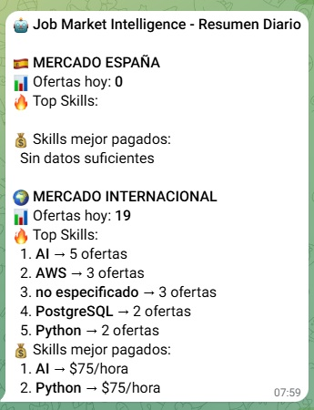
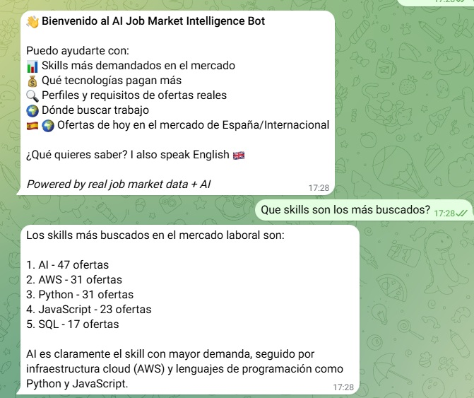
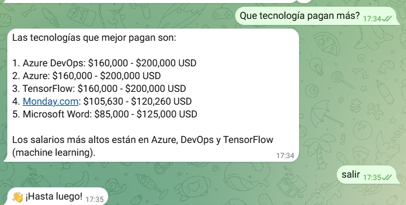

# 🤖 AI Job Market Intelligence Bot

> End-to-end data pipeline that tracks the AI/Data job market daily, 
> extracts insights using LLMs, and provides a conversational agent 
> to query real job market data via Telegram.

## What it does

- 📡 Scrapes daily job offers from RemoteOK, WeWorkRemotely and Google Jobs
- 🤖 Analyzes each offer with LLM to extract skills, salaries and technologies
- 📊 Sends daily Telegram summary with top skills and salary insights
- 💬 Conversational agent for custom queries about the job market

## Tech Stack

| Component | Technology |
|-----------|-----------|
| ELT Pipeline | Python, dbt, PostgreSQL (Neon) |
| LLM Analysis | Groq (llama-3.3-70b) |
| Agent & Tools | Anthropic Claude, Tool Calling, Graph, BM25, Semantic Cache
| RAG | sentence-transformers, ChromaDB |
| Automation | GitHub Actions |
| Notifications | Telegram Bot API |
| Observability | Langfuse, Guardrails
| Container | Docker

## Architecture

## Screenshots

## How it works

### 1. Daily Pipeline (4:00 AM UTC)
GitHub Actions triggers the scraper → LLM analysis → PostgreSQL storage → dbt transformation → Telegram summary

### 2. Conversational Agent
The Telegram bot accepts natural language queries and routes them to:
- **SQL tools** — skills demand, salary data, top platforms
- **RAG search** — semantic search over real job descriptions

### 3. LangGraph Pipeline
Conditional edges enable intelligent decisions:
- Skip processing if no new offers found
- Alert via Telegram if scraper returns < 10 results
- Validate offer quality before storing

### 4. Guardrails & Safety
- Input validation — domain classifier rejects off-topic queries
- Hallucination detection — verifies responses against real data
- Semantic cache — Redis persists responses across restarts (TTL 24h)

## Setup

\`\`\`bash
git clone https://github.com/alfredo-bb/ai-job-market-intelligence
cd ai-job-market-intelligence
pip install -r requirements.txt
cp .env.example .env  # add your API keys
python main.py        # run pipeline
python bot/telegram_bot.py  # start agent
\`\`\`